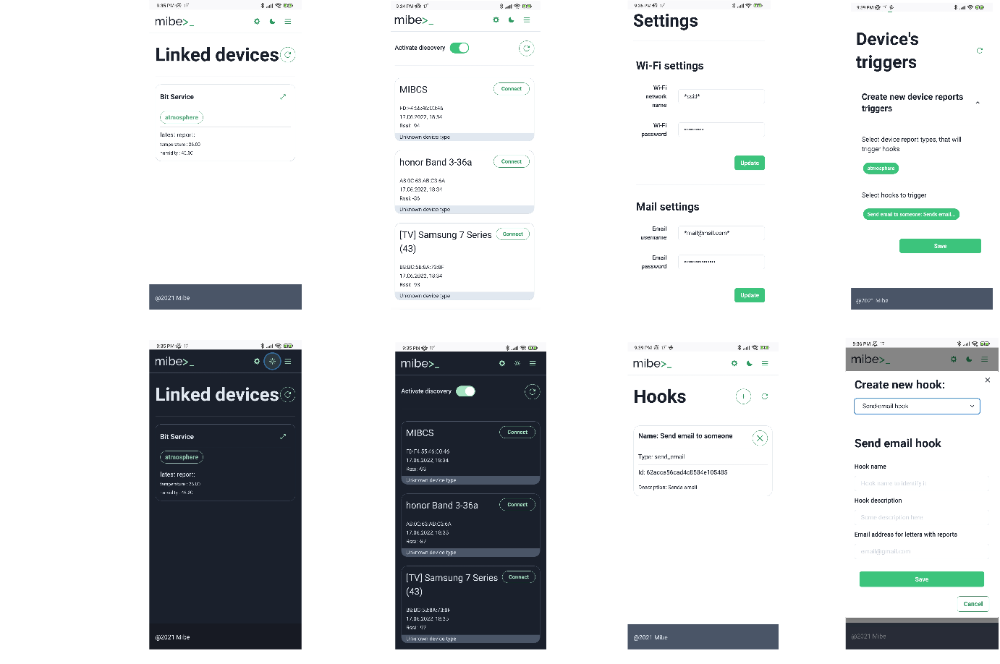
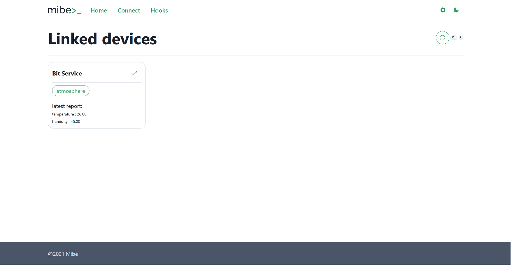
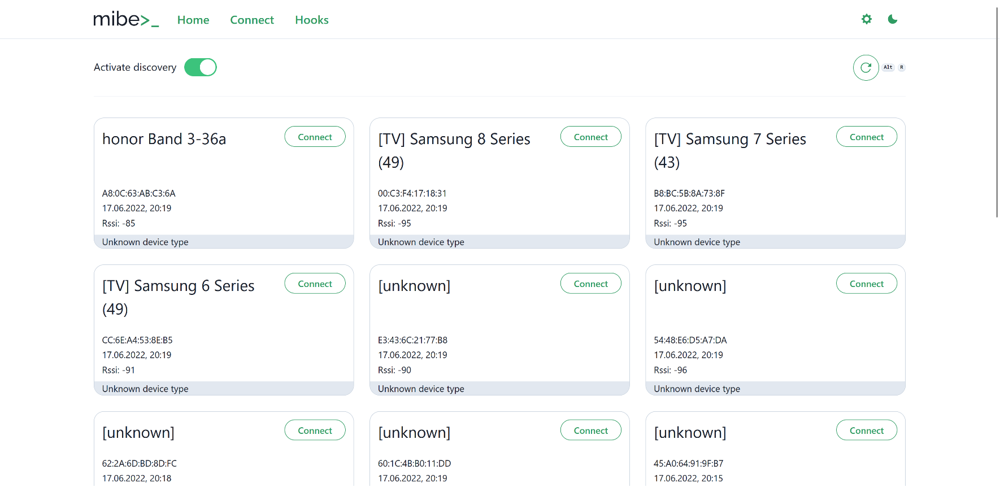
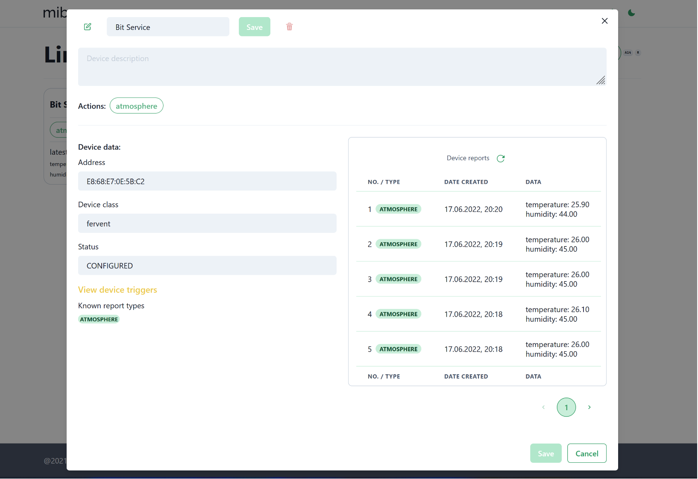
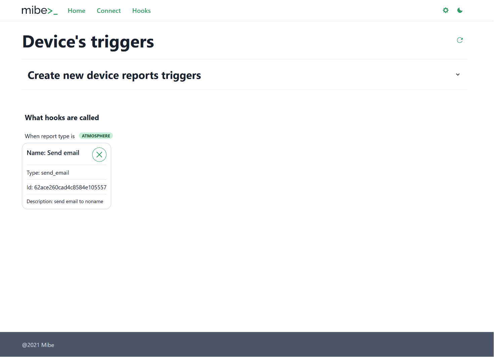

# Thinker's front-end

Welcome to the front-end part of the thinker!

Front-end is build using React and create-react-app. Application is developed to run on any system.

Repository also contains an image configuration that runs nginx with reverse-proxy to support back-end calls. You also
could run application in `dev` mode.

See also common thinker repository: https://github.com/mibe-iot/thinker

## Introduction

Thinker is a web-server that controls mibe-iot network. It consists of two parts: back-end and front-end. All
business-logic functions are performed ny back-end part. You can read more about it
here: https://github.com/mibe-iot/thinker-backend

This repository contains front-end part of thinker. It is React application, that consumes back-end API to provide user
with convenient and simply GUI. React application was chosen as a realisation of GUI because it offers great support for
any device that could consume HTTP traffic and HTML pages. Since that application could be accessed via any device:
mobile phone, PC or even Smart TV.

## Screenshots

### Mobile version screenshots:



### PC version

#### Home page:



### Discovery page:



### Device data view modal:



### Triggers page:



## Running application

### Running app via docker

This repository offers you a possibility to run application just by cloning a ready-to-use image:

```shell
docker pull ghcr.io/mibe-iot/thinker-frontend:latest
```

### Running app from sources

You could also run this application right after cloning. To run application in production you will need to build app
into static files and then use a server to serve your files. To do this you can use `serve`:

```shell
npm install serve -g
```

This image uses nginx to serve application on port `:80`. You can view [nginx.conf](./nginx.conf) to see server
configuration details.

This will install `serve` **globally**.

After installing `serve` you are ready to build and run application:

```shell
npm run build
serve -s build
```

### Running app from sources in dev mode

Or you could run app in dev mode. To do this, just run:

```shell
npm start
```

And then application will start on `localhost:3000`. Please note that in `dev` mode application expects thinker-backend
to be up and ready on `localhost:8080`. If you'd like to change it, see the end of [package.json](./package.json) file.

## Technologies used

- **React**. Official website: https://reactjs.org/
- **JS**
- **create-react-app**. Official website: https://create-react-app.dev/
- **npm**. Official website: https://www.npmjs.com/
- **RTK**. Official website: https://redux-toolkit.js.org/rtk-query/overview
- **Redux**. Official website: https://redux.js.org/
- **Chakra UI**. Official website: https://chakra-ui.com/
- **Axios**. Repository: https://github.com/axios/axios
- **Formik**. Official website: https://formik.org/docs/overview

## Contacts:

Feel free to reach me out in case of any question:

**Linked-in:** https://www.linkedin.com/in/ilya-buhlakou-33860b205/

**Mail:** ilboogl@gmail.com